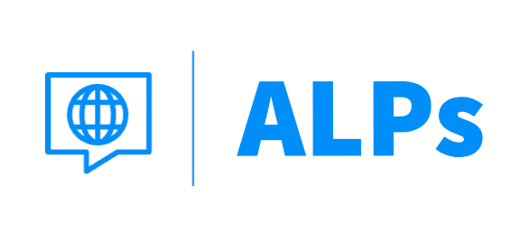

<!-- ReadMe -->

<!-- Opening -->
 

  
 
<!-- <h2 align="center"></h2> -->
  <h2 align="center">Advanced Language Practices (ALPs)</h2>
    

      Improve your language skills with inspiring images & immediate feedback!
      
 
      Now that you've "climbed the mountain" of learning another language, keep your skills fresh with regular practice! Language output (speaking & writing) is key but can get dull with routine drills, plus you may never know if it's entirely correct.  🔸  With ALPs, every writing challenge comes with an inspiring image to ignite your imagination, a random verb & grammar points to help focus your language, and immediate feedback with the help of AI!
    
 
    <a href="https://github.com/A-L-P-s/ALPs_api_sqlite_finale">Please visit the final BackEnd Repository</a>

 

 

---